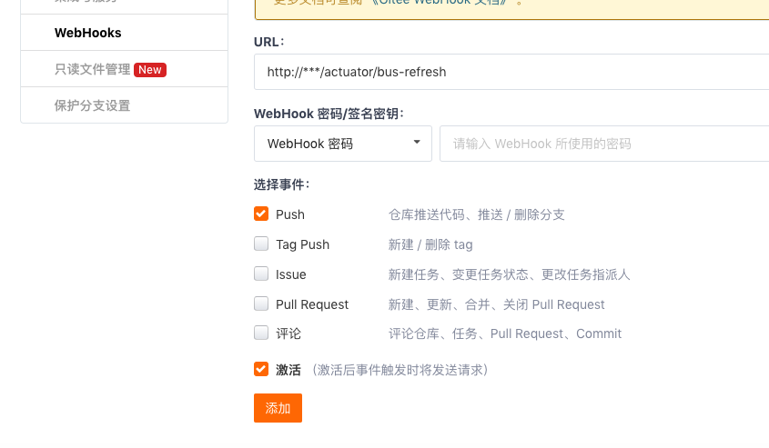

## 依赖

```xml
<!-- pom.xml -->
<dependency>
    <groupId>org.springframework.cloud</groupId>
    <artifactId>spring-cloud-config-server</artifactId>
</dependency>
```

## 配置

```yml
# application.yml
spring:
  application:
    name: config
  cloud:
    config:
      server:
        git:
          uri: https://github.com/xxx/xxx
          username: 123
          password: 456
          # 配置文件本地Git路径
          basedir: /Users/joey/Documents/GitHub/spring-cloud-sell/config/baseDir
eureka:
  client:
    service-url:
      defaultZone: http://localhost:8761/eureka/
```

## URL 命名规则

```js
/{name}-{profiles}.yml
/{label}/{name}-{profiles}.yml
// name 服务名
// profiles 环境
// label 分支(branch)
```

:::tip
/{name}-{profiles}.yml 后缀可以换成 `properties`,`json` 系统自动转换
:::

## 使用配置中心

1. 依赖

```xml
<!-- pom.xml -->
<dependency>
    <groupId>org.springframework.cloud</groupId>
    <artifactId>spring-cloud-config-client</artifactId>
</dependency>
```

2. 修改配置文件名称(application.yml=>bootstrap.yml)

3. 修改配置

```yml
# bootstrap.yml
# Git配置文件 /{name}-{profiles}.yml
spring:
  application:
    # 应用名
    name: ${name}
  cloud:
    config:
      discovery:
        enabled: true
        # config server 名称
        service-id: CONFIG
        # 环境名称
      profile: ${profiles}
eureka:
  client:
    service-url:
      defaultZone: http://localhost:8761/eureka/
```

:::tip
/{name}.yml会作为通用配置,加载到/{name}-{profiles}.yml中
:::

:::tip
注册中心配置最好放在本地,防止无法找到ConfigServer
:::

## [自动刷新应用(Bus)](https://cloud.spring.io/spring-cloud-static/spring-cloud-bus/2.2.1.RELEASE/reference/html/#refresh-scope)

1. 依赖(ConfigServer和应用)

```xml
<!-- pom.xml -->
<dependency>
    <groupId>org.springframework.cloud</groupId>
    <artifactId>spring-cloud-starter-bus-amqp</artifactId>
</dependency>
```

2.配置rabbitmq(ConfigServer和应用)

```yml
spring:
  rabbitmq:
    host: mybroker.com
    port: 5672
    username: user
    password: secret
```

3. 配置Bus Refresh Endpoint

```yml
management:
  endpoints:
    web:
      exposure:
        include: bus-refresh
```

4. 刷新配置(手动)

```js
POST configServer/actuator/bus-refresh
```

5. 自动刷新(Github...WebHook)

